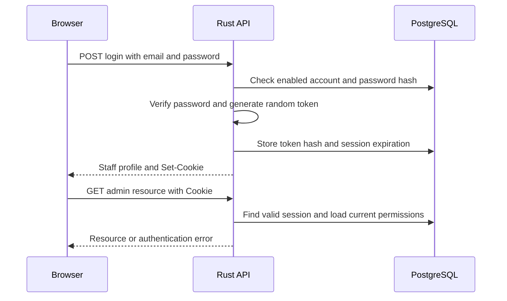

# Backend sessions and authentication

Knitnprint uses database-backed sessions. The browser stores an opaque token in a cookie, and PostgreSQL stores the session that token identifies. Axum validates the session before running an authenticated handler. We implement this directly in Rust rather than using JWTs or a general-purpose session package.

The main examples below cover admin sessions. Customer accounts use a separate session table and cookie. The setup examples show the same approach in a new Rust application and its equivalent in Express.

## What lives where

| Location | Stored information | Purpose |
| --- | --- | --- |
| Browser cookie | Random session token | Identifies the session on subsequent requests |
| `staff_sessions` | Token hash, staff account ID, creation and expiration times, revocation state | Determines whether the session is valid |
| `staff_users` | Email, password hash, role, disabled state | Identifies the account and verifies login credentials |
| `staff_capabilities` | Permissions assigned to staff | Determines what the account can do |

An opaque token is a random value with no embedded account information. It does not contain a role or permissions. The database session ID is also distinct from the browser token: knowing a row's `id` does not authenticate a request.

The session store is PostgreSQL, not an in-memory map in the Rust process. Multiple backend instances can validate the same session against the shared database, and restarting the backend does not erase sessions.

Schema: [staff users and sessions migration](../migrations/0002_staff_auth.sql).

## Login flow

`POST /api/admin/auth/login` accepts an email and password. The [login handler](../backend/src/auth.rs#L83) normalizes the email, applies login rate limits, and checks the password against an enabled staff account.

Passwords are hashed and verified with Argon2. Session tokens use SHA-256 instead: passwords need an intentionally expensive hash, while session tokens are already random, high-entropy values.

After a successful password check, the handler:

1. Generates a token by concatenating two random UUID v4 values.
2. Computes its SHA-256 hash.
3. Inserts a `staff_sessions` row with a separate UUID, the account ID, the token hash, and an expiration 12 hours ahead.
4. Records a login audit event and commits the transaction.
5. Returns the staff profile and sets the `knitnprint_admin` cookie containing the original token.

The token is not returned in the JSON profile or placed in browser local storage. PostgreSQL keeps its hash rather than the original token. Every successful login creates a new session; existing sessions are not automatically revoked by another login.



## Cookie configuration

The [session cookie helper](../backend/src/auth.rs#L335) sets these attributes:

| Attribute | Current value | Meaning |
| --- | --- | --- |
| Name | `knitnprint_admin` | Distinguishes staff sessions from customer sessions |
| `HttpOnly` | `true` | Browser JavaScript cannot read the token through `document.cookie` |
| `Secure` | Enabled in staging and production | Browser sends the cookie over HTTPS in deployed environments |
| `SameSite` | `Strict` | Restricts sending the cookie in cross-site contexts |
| `Path` | `/api/admin` | Browser sends it to admin API paths, including private image requests |
| `Max-Age` | 12 hours | Browser-side lifetime; PostgreSQL independently enforces expiration |
| `Domain` | Not set | Cookie belongs to the host that sets it |

[Backend startup](../backend/src/main.rs#L81) sets `secure_cookies` according to whether the environment is deployed. Local development allows HTTP cookies.

Cookie `Path` controls when the browser sends a cookie; authorization still comes from server-side checks. `SameSite` is about sites, not an exact origin allowlist, so it does not replace our request-origin checks.

## Validation on every authenticated request

The [AuthenticatedStaff extractor](../backend/src/auth.rs#L265) implements Axum's `FromRequestParts<AppState>`. An extractor converts information from a request into a handler argument. This one reads headers and shared application state without consuming the request body.

A handler opts into authentication by declaring an `AuthenticatedStaff` argument:

```rust
pub async fn settings(
    State(state): State<AppState>,
    actor: AuthenticatedStaff,
) -> Response {
    if let Err(response) = require_capability(&actor, "catalog.read") {
        return response.into_response();
    }
    // Load and return the resource using state.database.
    // Remaining handler code omitted here.
}
```

Before the handler executes, the extractor:

1. Reads the `knitnprint_admin` cookie using `CookieJar`.
2. Hashes the cookie token with SHA-256.
3. Queries `staff_sessions` joined to `staff_users`.
4. Requires an unrevoked, unexpired session and an enabled account.
5. Loads the account's current capabilities and supplies `AuthenticatedStaff` to the handler.

No cookie or an invalid session returns **401 Unauthorized**. An authenticated account without the endpoint's required permission returns **403 Forbidden**. A database failure returns **503 Service Unavailable** instead of granting access.

[Capability checks](../backend/src/auth.rs#L397) are separate from authentication. Owners pass every capability check; ordinary staff must have the explicitly assigned capability. Permissions are loaded on each authenticated request rather than copied into the browser token.

The admin expiration is fixed from login. Requests do not extend it, and there is currently no staff inactivity timeout. Although the schema has `last_seen_at`, the staff extractor does not update or enforce it.

## Browser requests and image URLs

The [shared API client](../packages/api-client/src/index.ts#L194) uses `credentials: 'include'` so browser API requests can include cookies. The [admin application](../apps/admin/src/main.tsx#L90) calls the profile endpoint to restore its signed-in UI after a refresh. That frontend profile is not proof of authorization; the backend still validates each protected request.

For the same image, the URLs differ by the access rules enforced by their handlers:

```text
Public thumbnail:
/api/media/01900000-0000-7000-8000-000000000001/thumbnail

Authenticated admin thumbnail:
/api/admin/product-media/01900000-0000-7000-8000-000000000001/thumbnail
```

The UUID is an example image identifier, not a secret.

The [public image handler](../backend/src/media.rs#L441) requires a ready image attached to an active product. It does not need an admin session. The [admin image handler](../backend/src/media.rs#L567) requires `AuthenticatedStaff` and `catalog.read`, and can serve ready images attached to draft, active, or archived products. Private image responses use `Cache-Control: private, no-store`.

[Admin catalog responses](../backend/src/catalog.rs#L1625) provide private image URLs. Public catalog responses provide public URLs. This fixes the earlier behavior where draft images appeared in admin only after publishing.

An ordinary image element is enough:

```html

```

The browser automatically sends the matching session cookie. JavaScript does not need to read the token or attach an `Authorization` header. Copying this URL to an unauthenticated browser does not grant access.

## Logout and cleanup

[Logout](../backend/src/auth.rs#L198) attempts to set the current session's `revoked_at`, records an audit event, and removes the browser cookie. It targets the current session rather than signing out every device.

[Disabling a staff account](../backend/src/staff.rs#L236) disables the account and revokes its sessions. Even without deleting session rows, subsequent authentication checks reject that account.

The [cleanup worker](../backend/src/bin/cleanup_sessions.rs) deletes expired sessions and sessions revoked beyond the configured retention period. It defaults to seven days for revoked-session retention. Expiration is enforced during requests, so cleanup is housekeeping rather than the mechanism that blocks expired sessions.

```sh
npm run admin:cleanup-sessions
```

This worker requires `DATABASE_URL`. `SESSION_RETENTION_DAYS` accepts values from 1 to 365.

### Known issue with logout failure handling

The current [staff logout handler](../backend/src/auth.rs#L198) silently ignores database failures. It can clear the browser cookie and return **204 No Content** without successfully revoking the session in PostgreSQL.

The handler uses an `if let` chain for starting the transaction, updating the session, and writing the audit event. Failures skip the remaining work rather than return an error. It also discards the result of `transaction.commit().await`. Cookie removal and the success response happen regardless of whether revocation committed. If the audit write fails, the session update in that transaction is rolled back.

Removing a cookie from one browser does not invalidate a copy held elsewhere. For example:

1. An attacker obtains a valid staff session token before logout.
2. The staff member signs out while the database is unavailable or the revocation transaction fails.
3. The browser removes its cookie and the logout endpoint reports success.
4. When the database is available again, the attacker can still use the copied token if its session remains unrevoked and unexpired and the account is enabled.

The token can remain usable for the rest of its original 12-hour lifetime. This issue does not let someone authenticate simply by knowing an image URL or a session row ID; it affects an already obtained valid token.

The proposed fix is to handle transaction, update, audit, and commit errors explicitly, and report a service error when revocation cannot be confirmed. Browser cookie removal can still be attempted on failure, but the response and admin UI must distinguish removing the local cookie from successfully invalidating the server session. An absent or already revoked session should remain safe to log out repeatedly.

Regression tests should cover successful logout rejecting reuse of the old token, transaction and audit failures leaving the session unrevoked without reporting success, commit error handling, and repeated logout. This fix is outstanding; documenting it does not change the current handler.

MFA for staff and a staff inactivity timeout are separate improvements. MFA would strengthen sign-in against stolen passwords; an inactivity timeout would shorten unused sessions. Neither substitutes for reliable logout revocation.

## Customer sessions

[Customer authentication](../backend/src/customer_auth.rs) uses the same general pattern with `knitnprint_customer`, `customer_sessions`, and `AuthenticatedCustomer`. Its cookie is scoped to `/api` and has a 30-day lifetime. It cannot authenticate staff endpoints.

Customer validation also checks account disablement, anonymization, and customer retention. It updates `last_seen_at` and refreshes customer retention, but those actions do not extend the session's `expires_at`. See the [customer schema](../migrations/0009_customer_accounts.sql) and [customer session extractor](../backend/src/customer_auth.rs#L866).

## Comparison with Express

Express with `express-session` follows the same broad flow: a cookie identifies a session stored on the server. Middleware restores `req.session`; our extractor restores `AuthenticatedStaff`. Express's built-in memory store is intended for development, so a shared store is needed for deployment across processes. See the [official express-session documentation](https://expressjs.com/en/resources/middleware/session/).

| Express concept | Knitnprint equivalent |
| --- | --- |
| Session ID cookie | `knitnprint_admin` opaque token cookie |
| Session store such as PostgreSQL or Redis | PostgreSQL `staff_sessions` |
| Session middleware | `AuthenticatedStaff` extractor |
| `req.session.userId` followed by an account lookup | Validated staff account supplied to the handler |
| Authorization middleware | `require_capability` |
| Session destruction | Database revocation and cookie removal |

The implementations are not interchangeable. `express-session` signs its session cookie using a secret; our cookie contains an unsigned random token accepted only when its hash matches a valid database session. We do not trust role or account information supplied in the cookie.

JWTs encode claims in a signed token. Our token carries no claims, and each authenticated request consults PostgreSQL. There is no JWT signing key or JWT verification step in this flow.

## Small setup examples for a new codebase

These examples illustrate the pieces to assemble; they are not complete applications. Supply account lookup, password verification, authorization, migrations, and error handling for the new project. Login must verify credentials before issuing a session.

### Rust with Axum and PostgreSQL

Use the dependency families in [backend Cargo.toml](../backend/Cargo.toml): Axum 0.8, axum-extra 0.12 with `cookie`, SQLx 0.8 with PostgreSQL and Tokio support, uuid 1 with `v4` and `v7`, sha2 0.10, time 0.3, and Argon2 0.5. Tokio runs the asynchronous application.

Create a session table referencing your existing user table:

```sql
CREATE TABLE sessions (
    id uuid PRIMARY KEY,
    user_id uuid NOT NULL REFERENCES users(id),
    token_hash bytea NOT NULL UNIQUE CHECK (octet_length(token_hash) = 32),
    created_at timestamptz NOT NULL DEFAULT now(),
    expires_at timestamptz NOT NULL,
    revoked_at timestamptz
);
```

The following helper issues a session after the caller has verified the password. Return the updated `CookieJar` as part of the HTTP response so Axum emits `Set-Cookie`.

```rust
use axum_extra::extract::cookie::{Cookie, CookieJar, SameSite};
use sha2::{Digest, Sha256};
use sqlx::PgPool;
use time::Duration;
use uuid::Uuid;

fn token_hash(token: &str) -> [u8; 32] {
    Sha256::digest(token.as_bytes()).into()
}

async fn issue_session(
    pool: &PgPool,
    jar: CookieJar,
    verified_user_id: Uuid,
    secure: bool,
) -> Result<CookieJar, sqlx::Error> {
    let token = format!("{}{}", Uuid::new_v4().simple(), Uuid::new_v4().simple());
    sqlx::query(
        "INSERT INTO sessions (id, user_id, token_hash, expires_at)
         VALUES ($1, $2, $3, now() + interval '12 hours')",
    )
    .bind(Uuid::now_v7())
    .bind(verified_user_id)
    .bind(token_hash(&token).as_slice())
    .execute(pool)
    .await?;

    Ok(jar.add(Cookie::build(("app_session", token))
        .http_only(true)
        .secure(secure)
        .same_site(SameSite::Strict)
        .path("/api")
        .max_age(Duration::hours(12))
        .build()))
}
```

For example, after validating credentials, a login handler can return `(updated_jar, StatusCode::NO_CONTENT)`. Set `secure` to true when serving over HTTPS in deployed environments.

Next, implement a request extractor. Here `AppState` holds a required `PgPool`, and the project's `users` table has a nullable `disabled_at` column:

```rust
use axum::{extract::FromRequestParts, http::{request::Parts, StatusCode}};

#[derive(Clone)]
struct AppState { database: PgPool }
struct AuthenticatedUser { id: Uuid }

impl FromRequestParts<AppState> for AuthenticatedUser {
    type Rejection = StatusCode;

    async fn from_request_parts(
        parts: &mut Parts,
        state: &AppState,
    ) -> Result<Self, Self::Rejection> {
        let jar = CookieJar::from_request_parts(parts, state)
            .await.map_err(|_| StatusCode::UNAUTHORIZED)?;
        let cookie = jar.get("app_session").ok_or(StatusCode::UNAUTHORIZED)?;
        let id: Option<Uuid> = sqlx::query_scalar(
            "SELECT s.user_id FROM sessions s JOIN users u ON u.id = s.user_id
             WHERE s.token_hash = $1 AND s.revoked_at IS NULL
               AND s.expires_at > now() AND u.disabled_at IS NULL",
        )
        .bind(token_hash(cookie.value()).as_slice())
        .fetch_optional(&state.database)
        .await.map_err(|_| StatusCode::SERVICE_UNAVAILABLE)?;
        Ok(Self { id: id.ok_or(StatusCode::UNAUTHORIZED)? })
    }
}
```

Protect a handler by requiring that extractor:

```rust
async fn me(user: AuthenticatedUser) -> String {
    user.id.to_string()
}

// In application setup, with app_state holding the connected database pool:
let routes = axum::Router::new()
    .route("/api/me", axum::routing::get(me))
    .with_state(app_state);
```

A resource endpoint should additionally load and check current permissions. For logout, update the matching token hash's `revoked_at`, check that the write succeeds, and then return a jar with `app_session` removed using the same `/api` path. Keep browser cookie removal separate from database revocation: both are needed.

### Express with a PostgreSQL session store

Install `express`, `express-session`, `connect-pg-simple`, and `pg`. This configuration uses a database store instead of `MemoryStore`:

```js
const express = require('express');
const session = require('express-session');
const PgStore = require('connect-pg-simple')(session);
const { Pool } = require('pg');
const app = express();
const deployed = process.env.NODE_ENV === 'production';
if (!process.env.SESSION_SECRET) throw new Error('SESSION_SECRET is required');

app.use(express.json());
app.use(session({
  name: 'app_session',
  secret: process.env.SESSION_SECRET,
  store: new PgStore({
    pool: new Pool({ connectionString: process.env.DATABASE_URL }),
    createTableIfMissing: true,
    disableTouch: true,
  }),
  resave: false,
  saveUninitialized: false,
  cookie: { httpOnly: true, secure: deployed, sameSite: 'strict',
            path: '/api', maxAge: 12 * 60 * 60 * 1000 },
}));
```

For a new local project, `createTableIfMissing` provides the store table. For a deployed project, create it through a migration. `disableTouch` prevents ordinary store touches from extending database TTL. These options are documented by [connect-pg-simple](https://github.com/voxpelli/node-connect-pg-simple).

When HTTPS terminates at a proxy, configure Express's `trust proxy` for the actual trusted topology before enabling secure cookies. The session secret signs cookies; keep it outside source control. [Express documents secure cookies and proxy configuration](https://expressjs.com/en/resources/middleware/session/#cookie-secure).

After password verification, regenerate the session, record the verified user ID, and save it before responding:

```js
// Inside a login handler after obtaining verifiedUser from password verification:
req.session.regenerate((err) => {
  if (err) return next(err);
  req.session.userId = verifiedUser.id;
  req.session.expiresAt = Date.now() + 12 * 60 * 60 * 1000;
  req.session.save((err) => err ? next(err) : res.sendStatus(204));
});
```

A protected handler checks both the session and the current account:

```js
// getEnabledUser is a project function that queries your users table.
app.get('/api/me', async (req, res, next) => {
  try {
    if (!req.session.userId || Date.now() >= req.session.expiresAt)
      return res.sendStatus(401);
    const user = await getEnabledUser(req.session.userId);
    if (!user) return res.sendStatus(401);
    res.json({ id: user.id });
  } catch (err) { next(err); }
});
```

Destroy the stored session on logout and clear the matching cookie. Check destruction errors before returning success. Session regeneration, saving, and destruction are described in the [session API](https://expressjs.com/en/resources/middleware/session/#session-regenerate-callback) and implemented in the [library source](https://github.com/expressjs/session/blob/master/index.js).

This Express example uses its library's session schema and cookie format; it does not reproduce our token-hash schema.

## Libraries and their role in our code

The declared dependency versions are in [backend Cargo.toml](../backend/Cargo.toml); resolved versions are in [Cargo.lock](../Cargo.lock).

| Library | What it is | How we use it |
| --- | --- | --- |
| [Axum](https://docs.rs/axum/latest/axum/extract/trait.FromRequestParts.html) | Rust HTTP framework | Routes, handlers, shared state, and the custom authentication extractor |
| [axum-extra CookieJar](https://docs.rs/axum-extra/latest/axum_extra/extract/cookie/struct.CookieJar.html) | Cookie extraction and response helpers | Reads incoming cookies; returning a modified jar sets or removes cookies |
| [SQLx](https://docs.rs/sqlx/0.8.6/sqlx/) | Asynchronous database library | PostgreSQL connection pooling, parameterized session queries, transactions, and migrations |
| [Argon2](https://docs.rs/argon2/latest/argon2/) | Password hashing algorithm and Rust implementation | Salted password hashes and verification at login |
| [sha2](https://docs.rs/sha2/latest/sha2/) | SHA-2 hash implementations | SHA-256 hashes of random session tokens for database lookup |
| [uuid](https://docs.rs/uuid/1/uuid/struct.Uuid.html) | UUID generation and parsing | Random UUID v4 values for token generation; UUID v7 for session row IDs |
| [time](https://docs.rs/time/latest/time/struct.Duration.html) | Time types and arithmetic | Cookie durations such as 12 hours |
| [tower-http CORS](https://docs.rs/tower-http/latest/tower_http/cors/) | HTTP middleware | Explicit allowed origins and credentialed CORS in the API router |

CookieJar itself does not validate the database session. Our `AuthenticatedStaff` implementation supplies that logic. SQLx parameters keep token hashes separate from SQL text. CORS controls browser access across origins; it is not an authentication mechanism.

## Security protections and follow-ups

The current code provides random tokens, hashed session storage, Argon2 password verification, protected cookies, login rate limits, enabled-account checks, and per-request permissions. [Security middleware](../backend/src/security.rs) checks request origins for state-changing browser requests. [Login rate limiting](../backend/src/login_rate_limit.rs) uses PostgreSQL buckets and advisory locks so separate backend instances share limits.

A stolen browser token remains a bearer credential: whoever possesses it can use the session while it remains valid. `HttpOnly` prevents JavaScript from reading the cookie but cannot stop malicious code in the admin page from making authenticated requests. These limitations and cookie protections are discussed in [OWASP session guidance](https://cheatsheetseries.owasp.org/cheatsheets/Session_Management_Cheat_Sheet.html).

The outstanding improvements discussed are reliable logout failure handling, MFA for staff, and a staff inactivity timeout. None is implemented by this guide. A 12-hour absolute expiration already exists; an inactivity timeout would be a separate check based on the last authenticated activity.

Useful regression tests are [staff authorization](../backend/tests/staff_authorization.rs), [login limit concurrency](../backend/tests/login_rate_limit_concurrency.rs), and [product image visibility](../backend/tests/product_media_visibility.rs). They exercise account permissions, shared login limits, and private draft image access.
